# Flutter Firebase Cloud Messaging Tutorial

Push notifications are one of the most important concepts that should
be thought to each mobile developer. It helps users to get informed
proactively regardless the app is on foreground or not. 

For this purpose there are several services that can send downstream 
messages to your application. The app will be listening to those 
downstream messages and handling in the background with the configuration
settings that is provided.

> With this tutorial, your Flutter app can receive and process push notifications as well as data messages on Android and iOS. Read Firebase's [About FCM Messages](https://firebase.google.com/docs/cloud-messaging/concept-options) to learn more about the differences between notification messages and data messages.

#### Tutorial Sections
- [Android Setup](#android-setup)
- [iOS Setup](#iOS-setup)
- [Dart code](#dart-code)

## Initial Setup

**Android** and **iOS** integration has different setups. They will be handled
here. General findings about both platforms will be shared at the very end. Click [here](#dart-code)
to jump to that section. 

### <a name="android-setup"></a>Android Setup

#### Firebase Console Setup

For setting up any Firebase project, you need to do some set of steps to be able to make 
Firebase work for your project. 

Once you create your Firebase project from the [Firebase](http://console.firebase.google.com/) console, you will a screen like
below. 


Click on the Android icon there and let the wizard take you to the following page.

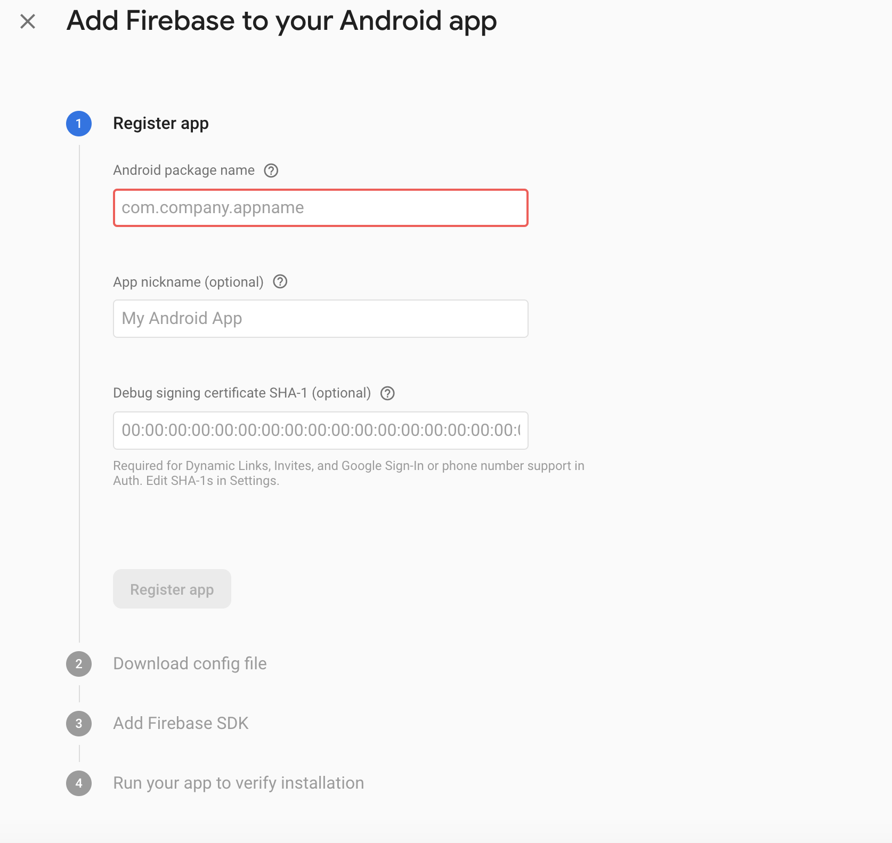

At this page, you are expected to enter the package name of your application, app name and SHA-1 code.

**_Please keep in mind that, even though some fields are optional, not adding them might cause some problems. 
Therefore, Please fill all the fields._**

After filling all the necessary information, you can go to next step and download the `google-services.json`
file.

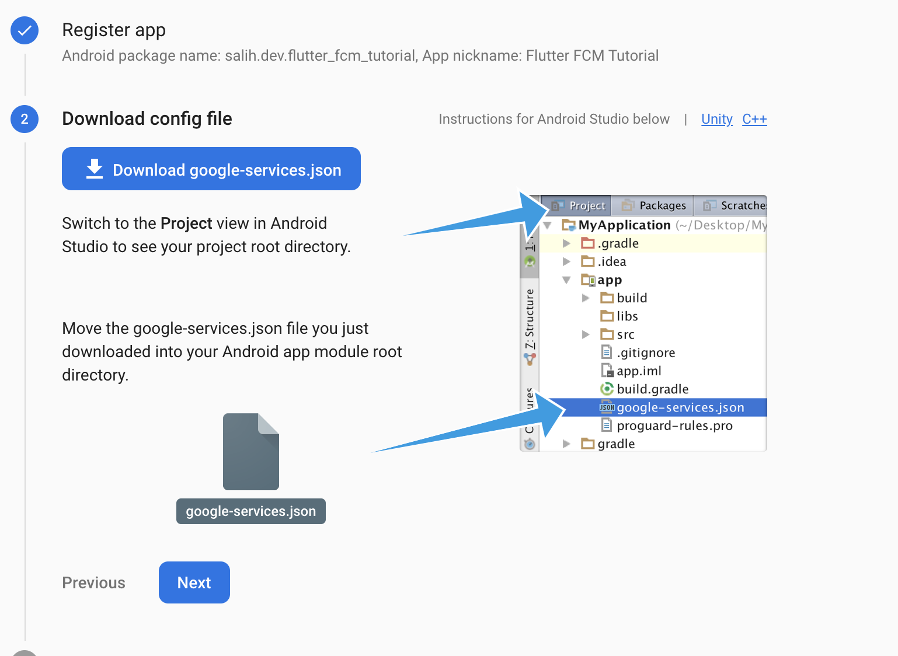

When the file download is done, from this point onwards you will go back to your IDE.

### Firebase Project Setup

First you will copy the `google-services.json` file to your project under `android/app` folder. 

> This is an important file and you should not push this to your version control system. Add 
> `android/app/google-services.json` to your project's  .gitignore file.

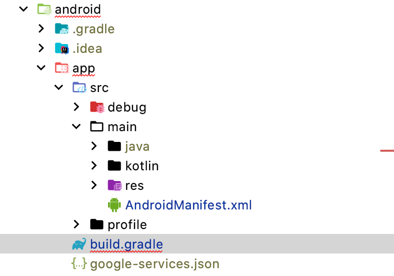

Now you are going to add the additional configurations for Android project.

Start by adding the classpath to the [project]/android/build.gradle file.

```
dependencies {
  // Example existing classpath
  classpath 'com.android.tools.build:gradle:3.5.3'
  // Add the google services classpath
  classpath 'com.google.gms:google-services:4.3.2'
}
```

If you already have one of the classpaths above, please use the one that is more up-to date.

Once you add the previous classpaths, Add the apply plugin to the [project]/android/app/build.gradle file.

```
// ADD THIS AT THE BOTTOM
apply plugin: 'com.google.gms.google-services'
``` 
 
This will help you to use the play services on the application, if you do not use this, your application will 
not be registered.

You would most likely want to be notified in your app when the user clicks on a notification in the system tray include the following 
intent-filter within the `<activity>` tag of your `android/app/src/main/AndroidManifest.xml` (to help you out, you can 
also put it under the already existing `intent-filter` as well.):

```
<intent-filter>
  <action android:name="FLUTTER_NOTIFICATION_CLICK" />
  <category android:name="android.intent.category.DEFAULT" />
</intent-filter>
```

> Background message handling is intended to be performed quickly. Do not perform long running tasks as they may not be 
> allowed to finish by the Android ecosystem. See [Background Execution Limits](https://developer.android.com/about/versions/oreo/background) for more.

Once the Firebase setup is done, now it is time to set up the Firebase libraries to be used.

### Adding Firebase Cloud Messaging libraries

By default, background messaging and receiving downstream messages are blocked in Android ecosystem. For enabling these,
you need to use Firebase Cloud Messaging service. For using this service, first add the `com.google.firebase:firebase-messaging` 
dependency in your app-level `build.gradle` file that is located at `/android/app/build.gradle`.

```
dependencies {
  // ...

  implementation 'com.google.firebase:firebase-messaging:<[latest_version](https://firebase.google.com/support/release-notes/android#latest_sdk_versions)>'
  // e.g. implementation 'com.google.firebase:firebase-messaging:20.2.4'
}
```

Now that you added the Firebase library to the project, as a next step, you need to register your application to listen and use 
the plugin for the Flutter side.

For that let's create an Application class by extending [FlutterApplication](https://api.flutter.dev/javadoc/io/flutter/app/FlutterApplication.html). 
Create an Application file under `<app-name>/android/app/src/main/java/<app-organization-path>/` with the language of your choice for Android.
For this project, you will see Kotlin example with file `Application.kt`.

```
package com.domain.your_app_name;

import io.flutter.app.FlutterApplication
import io.flutter.plugin.common.PluginRegistry
import io.flutter.plugin.common.PluginRegistry.PluginRegistrantCallback
import io.flutter.plugins.GeneratedPluginRegistrant
import io.flutter.plugins.firebasemessaging.FlutterFirebaseMessagingService

class Application : FlutterApplication(), PluginRegistrantCallback {
    override fun onCreate() {
        super.onCreate()
        FlutterFirebaseMessagingService.setPluginRegistrant(this)
    }

    override fun registerWith(registry: PluginRegistry) {
        GeneratedPluginRegistrant.registerWith(registry)
    }
}
```

With this step, you finalized the setup for Android, if you want to try this directly on Android you can skip to the [next step](#dart-code).
If you would like to continue with iOS setup, let's continue.

### <a name="iOS-setup"></a>iOS Setup

> Important note: To test push notifications on iOS an iOS device is required. Apple’s push notifications cannot be sent to simulators.

####  Apple Push Notification service (APNs) configuration

The Firebase Cloud Messaging APNs interface uses the Apple Push Notification service (APNs) to send messages up to 4KB in 
size to your iOS app, including when it is in the background.

To enable sending Push Notifications through APNs, you need:

- An Apple Push Notification Authentication Key for your Apple Developer account. Firebase Cloud Messaging uses this token to send Push Notifications to the application identified by the App ID.

You can create that in the [Apple Developer Member Center](https://developer.apple.com/account/#/welcome).


1. In your developer account, go to **Certificates, Identifiers & Profiles**.
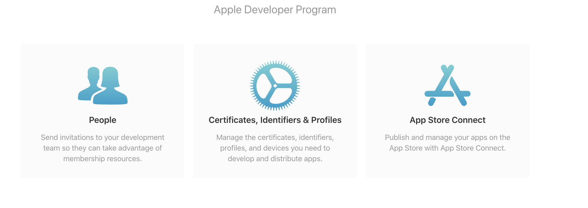

2. Click on the **Keys** on the left pange
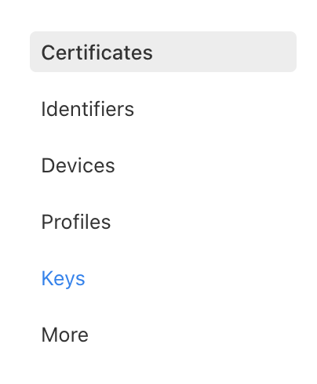

3. Click the plus button to add a new key.


4. Register the APN key from the form.
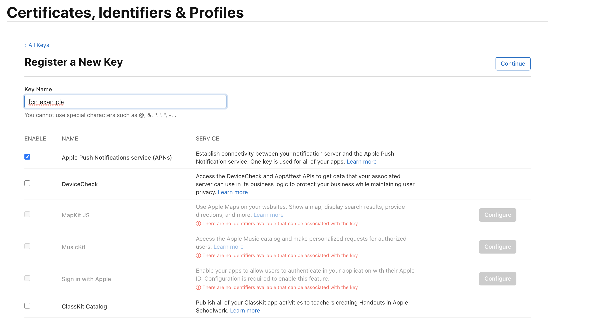

5. Download the key.
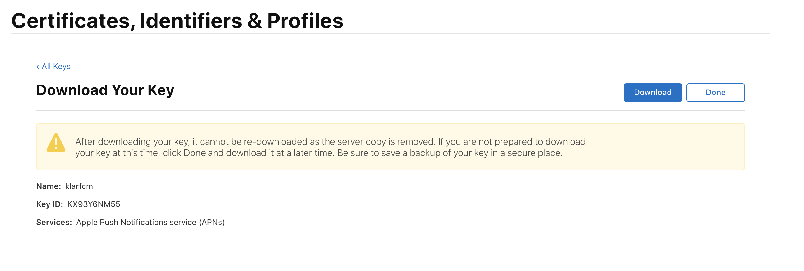

#### Firebase Console Setup


Click on the iOS icon there and let the wizard take you to the following page.

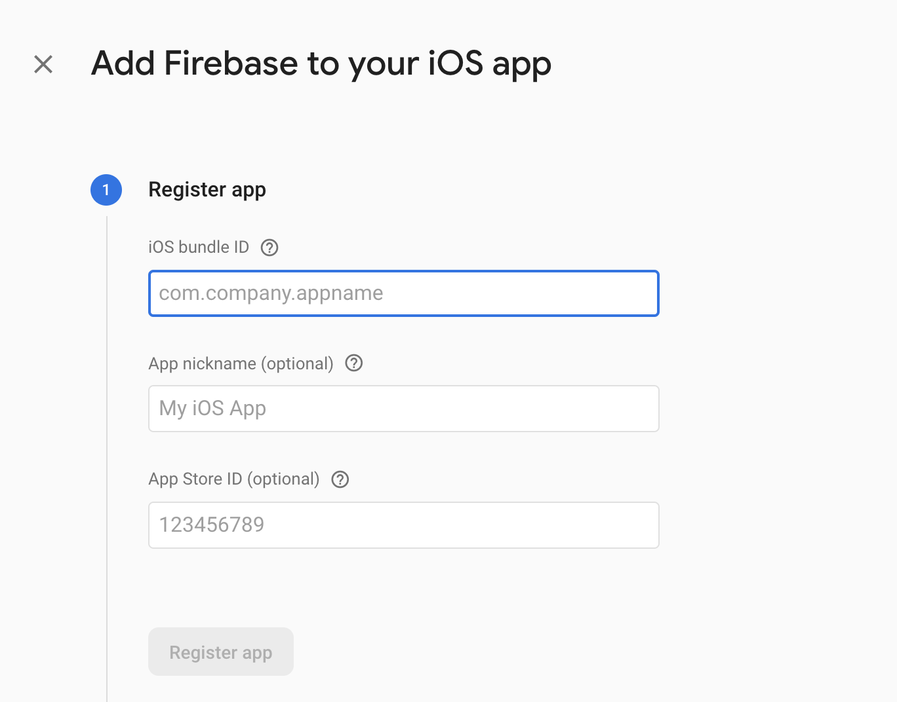

Fill out all the information that you can provide. If you don't have a data for a field at the moment,
you can come back and fill that out later on. 

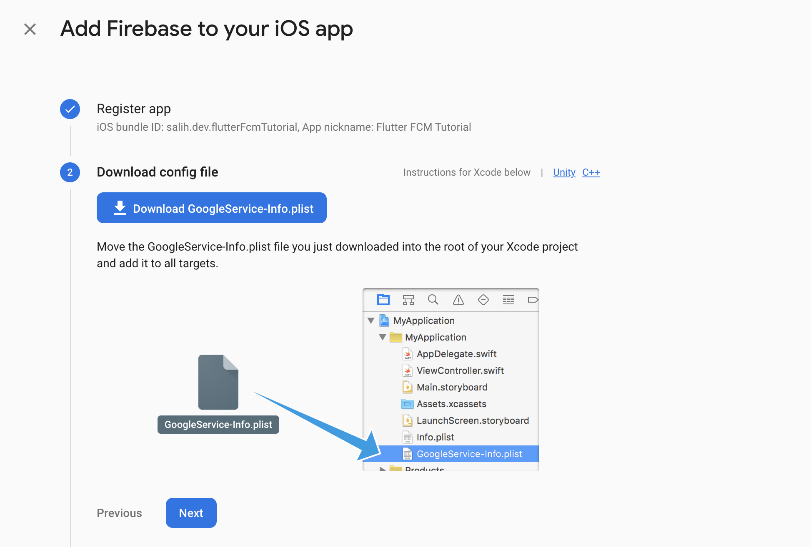

Click the `Download GoogleService-Info.plist` button for downloading the requested _plist_ file.

You don't have to do the rest of the steps. 

#### Firebase Project Setup

Once you download the file, now you can setup your iOS project. First copy the file to 
`ios/Runner` directory.  

> This is an important file and you should not push this to your version control system. Add 
> `ios/Runner/GoogleService-Info.plist` to your project's  .gitignore file.

After that, open the iOS project on XCode and do the following:

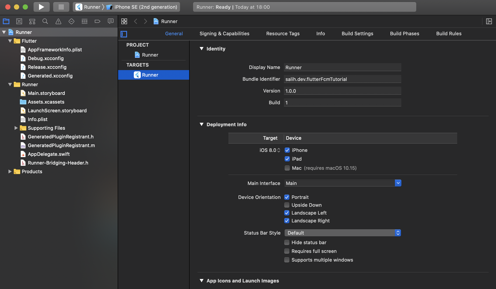

1. In Xcode, select Runner in the Project Navigator. 

2. Add capabilities by clicking `+ Capability` button, turn on Push Notifications and Background Modes.
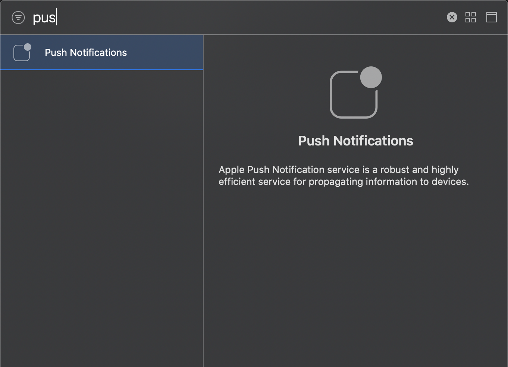
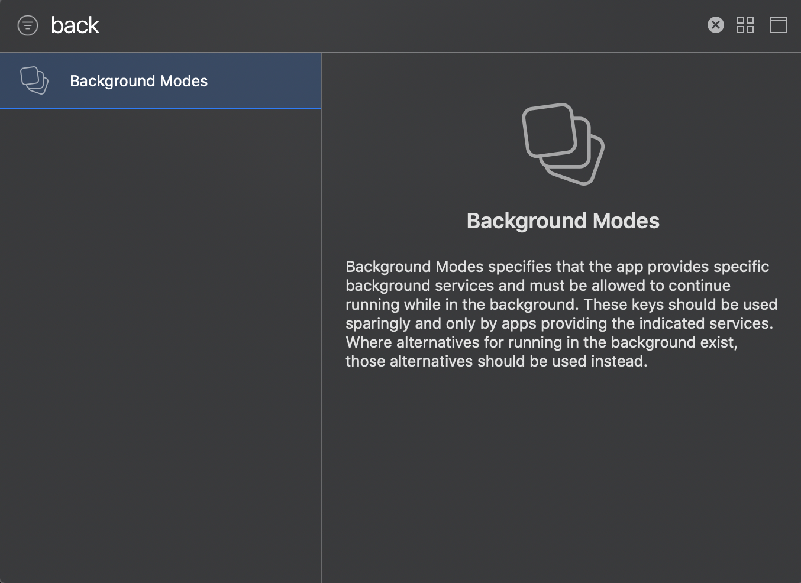
3. Enable `Background fetch` and `Remote notifications` under Background Modes.
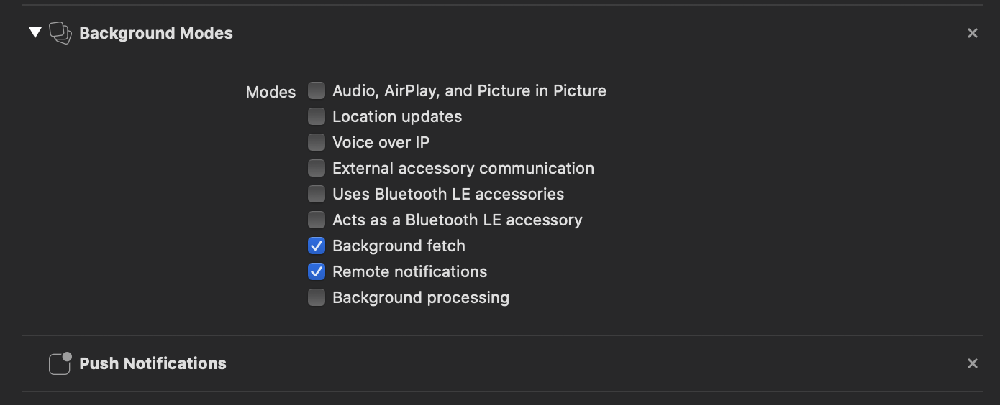
4. If you need to disable the method swizzling done by the FCM iOS SDK (e.g. so that you can use this plugin with other notification plugins) 
then add the following to your application's Info.plist file.
```
<key>FirebaseAppDelegateProxyEnabled</key>
<false/>
```
After that, add the following lines to the 
```
override func application(
    _ application: UIApplication,
    didFinishLaunchingWithOptions launchOptions: [UIApplication.LaunchOptionsKey: Any]?
) 
``` 
method in the `AppDelegate.swift` of your iOS project.

```
if #available(iOS 10.0, *) {
  UNUserNotificationCenter.current().delegate = self as? UNUserNotificationCenterDelegate
}
```

Now that you prepared your project for the push notifications. Let's continue with uploading the APN certificate 
you previously downloaded.

At the screen below, click on the small wheel to go to the project settings and do the following steps:


1. Direct yourself to the **Cloud Messaging** in the Settings page.

2. After that, scroll down to the **iOS app Configuration** section.
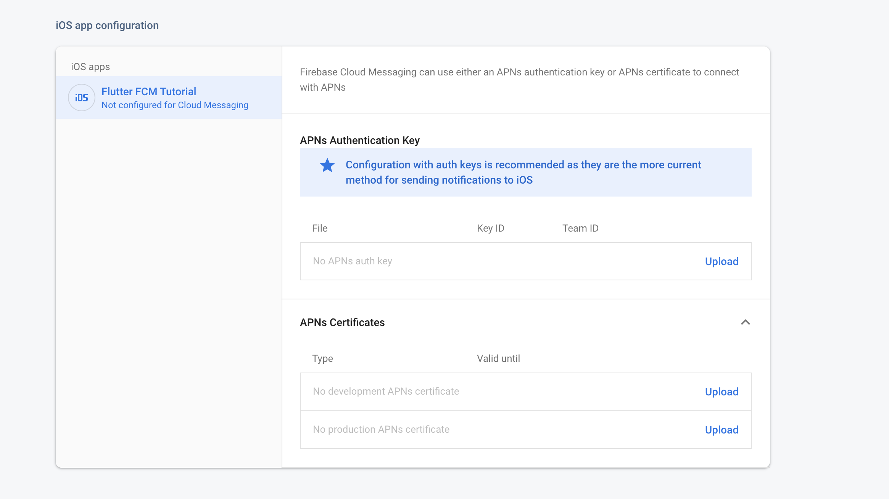
3. Click on **Upload** button at the _APNs Authentication Key_ section.
4. Upload your APN certificate to the opened up dialog. 
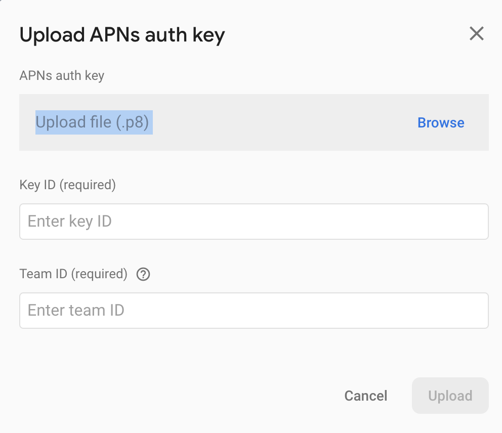

Now you are done with the configuration. I know it was too long but it was great as well. Let's write some Dart code
to handle the notifications now!

#### iOS Notification Permissions

After the `FirebaseMessaging` object is created, use that object to ask for permission to send notifications. It will use the 
system dialog to ask permission to the user.

Add the following code at any point in your application to ask for notification permission to the user:

```
_firebaseMessaging.requestNotificationPermissions(
    const IosNotificationSettings(
        sound: true, badge: true, alert: true, provisional: true));
_firebaseMessaging.onIosSettingsRegistered
    .listen((IosNotificationSettings settings) {
  print("Settings registered: $settings");
});
```

You will add it to `initState` in your _main.dart_ file in our example. 

## <a name="dart-code"></a>Let's write some Dart code

Messages are sent to your Flutter app via the `onMessage`, `onLaunch`, and `onResume` callbacks 
that you configured with the plugin during setup. Here is how different message types are delivered on the supported platforms:

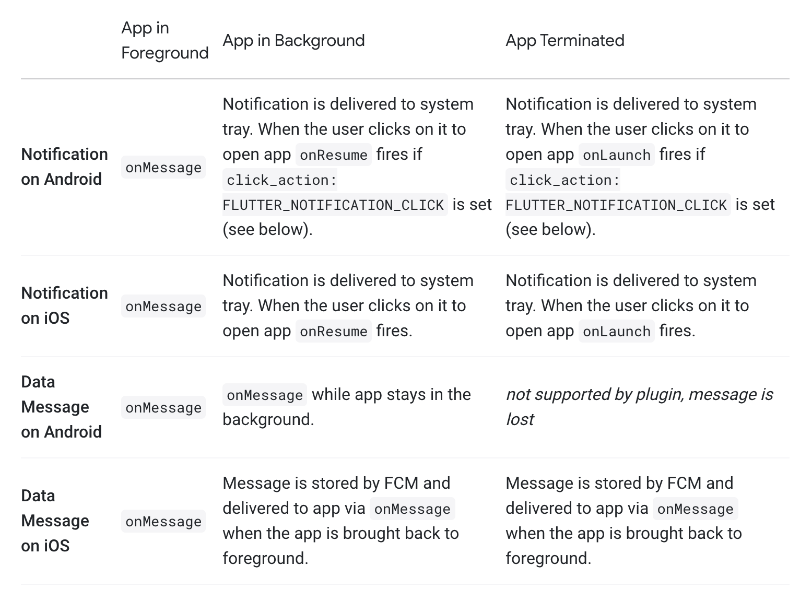

 
For starting off, we will use a `StatefulWidget` for the main widget to handle notifications.
StatefulWidgets has a special class called `State`. State has its own widget life cycle so we can subscribe and remove subscriptions.

You will start by, creating a `FirebaseMessaging` object on the top level of State class: 
```
  final FirebaseMessaging _firebaseMessaging = FirebaseMessaging();
```  

For listening to background messages or how the notification should behave within the application, you will register the listening
behavior with `FirebaseMessaging` object's `configure` method. First override the `initState` method of the State class. After that,
add the code below in it. 

```
  _firebaseMessaging.configure(
    onMessage: (Map<String, dynamic> message) async {
      print("onMessage: $message");
    },
    onBackgroundMessage: backgroundMessageHandler,
    onLaunch: (Map<String, dynamic> message) async {
      print("onLaunch: $message");
    },
    onResume: (Map<String, dynamic> message) async {
      print("onResume: $message");
    },
  );

  // Static or Top level function
  static Future<dynamic> backgroundMessageHandler(Map<String, dynamic> message) async {
    if (message.containsKey('data')) {
      // Handle data message
      final dynamic data = message['data'];
      print("onBackgroundMessage: $data");
    }

    if (message.containsKey('notification')) {
      // Handle notification message
      final dynamic notification = message['notification'];
      print("onBackgroundMessage: $notification");
    }
    // Or do other work.
  }
``` 
 
Basically you added the configurations for all of the possible lifecycles and each has a print statement now.
When you send a notification you will see that it is going to print out the information it retrieved.

Go to Firebase console and direct yourself to **Cloud Messaging** on the left pane. Once you click on it, take yourself to 
message sending page as it is below.

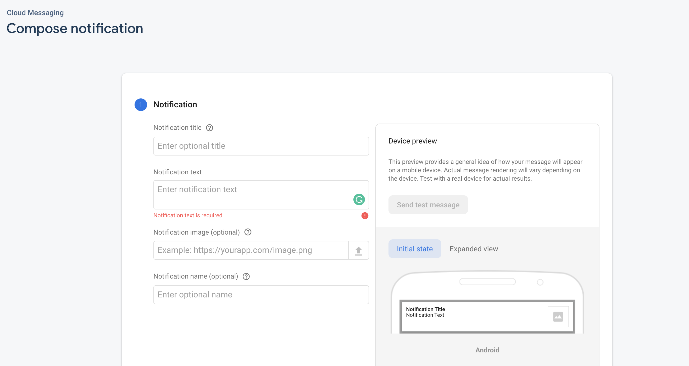

You can see how it is going to look like on the window as well. Once you fill out the information for notification, it will ask you for 
a token. For getting the token, you can use the following code in your `initState` method.

```
_firebaseMessaging.getToken().then((String token) {
  assert(token != null);
  setState(() {
    _homeScreenText = "Push Messaging token: $token";
  });
  print(_homeScreenText);
});
``` 

Once you have the token, you can copy and paste it from the console and put it to Firebase console. Once you add the token, 
you can send the notification. If the app is in the background, you will see it on your phone.
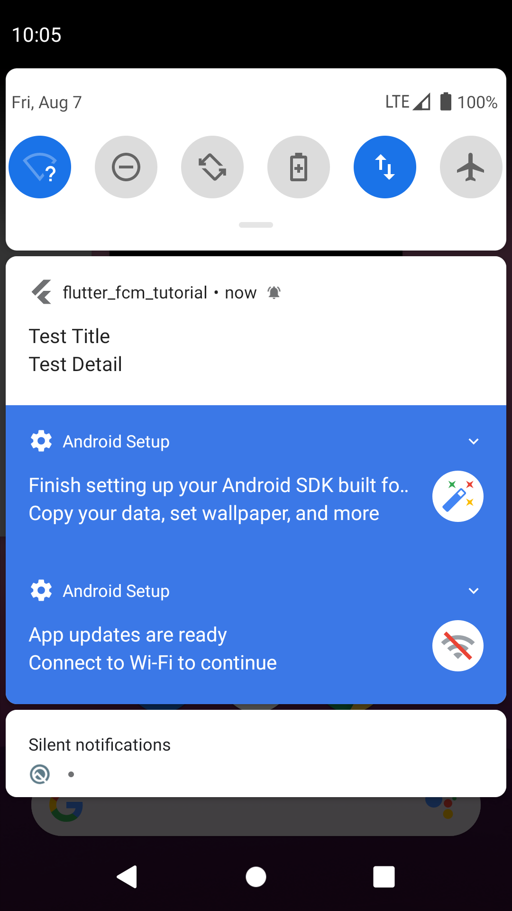

If you wonder about what will it show with your print statements, it will show something like below:
```
I/flutter (10090): onMessage: {notification: {title: Test Title, body: Test Detail}, data: {}}
```

That's it! Now you are ready for receiving notifications! Good job!


 


  

 


 